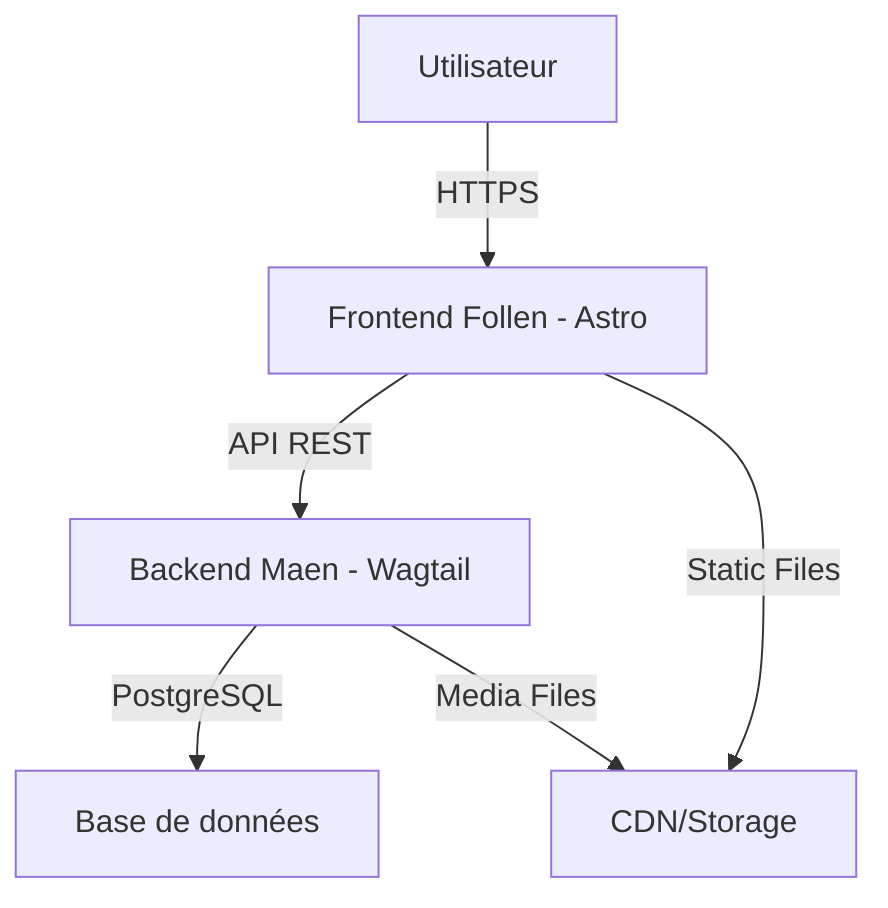

# Plateforme Follen-Maen - Documentation Unifiée

**Dernière mise à jour** : 10 janvier 2025

## 📋 Table des Matières

- [Aperçu de la Plateforme](#aperçu-de-la-plateforme)
- [Architecture Globale](#architecture-globale)
- [Follen - Frontend Astro](#follen---frontend-astro)
- [Maen - Backend Wagtail](#maen---backend-wagtail)
- [Plateforme d'Hébergement](#plateforme-dhébergement)
- [Workflow de Développement](#workflow-de-développement)
- [Améliorations Prioritaires](#améliorations-prioritaires)
- [Documentation Technique](#documentation-technique)

## 🎯 Aperçu de la Plateforme

**Follen-Maen** est une plateforme web moderne pour un site syndical, combinant un frontend statique (Astro) avec un backend CMS headless (Wagtail). Cette architecture permet une expérience utilisateur rapide et réactive tout en offrant une gestion de contenu puissante.

**Objectifs principaux** :
- Fournir une plateforme de communication pour un syndicat
- Permettre une gestion facile du contenu par des non-techniciens
- Offrir une expérience utilisateur optimisée et accessible
- Assurer une maintenance et une évolution faciles

## 🏗 Architecture Globale



### Composants Principaux

1. **Frontend (Follen)** : Site statique généré avec Astro, hébergé sur Dokploy
2. **Backend (Maen)** : CMS Wagtail avec API REST, hébergé sur Dokploy
3. **Base de données** : PostgreSQL gérée par Dokploy
4. **Storage** : Volume persistant pour les médias
5. **Reverse Proxy** : Traefik avec certificats SSL Let's Encrypt

## 🌐 Follen - Frontend Astro

### Technologies

- **Framework** : Astro 5.16.5
- **Styling** : Tailwind CSS 3.4.0
- **Search** : Pagefind 1.4.0
- **Build** : Docker + Nginx
- **Déploiement** : Dokploy sur VPS personnel

### Fonctionnalités

- **Pages dynamiques** : Chargement du contenu depuis l'API Wagtail
- **Design responsive** : Adapté à tous les appareils
- **Navigation intuitive** : Double navbar avec menu responsive
- **Affichage des articles** : Liste et détails des articles de blog
- **Pages statiques** : Support pour les pages statiques
- **Formulaires dynamiques** : Intégration avec les formulaires Wagtail
- **Recherche intégrée** : Fonctionnalité de recherche avec Pagefind

### Structure

```
src/
├── components/    # Composants réutilisables
├── layouts/       # Layouts de base
├── pages/         # Pages du site
├── lib/           # Fonctions utilitaires (API, etc.)
└── types/         # Définitions TypeScript
```

## 🗃 Maen - Backend Wagtail

### Technologies

- **Framework** : Django 4.2.17 + Wagtail 7.2.1
- **API** : Django REST Framework 3.15.2
- **Base de données** : PostgreSQL
- **Serveur** : Gunicorn
- **Déploiement** : Dokploy sur VPS personnel

### Fonctionnalités

- **API Headless complète** : Endpoints standard et personnalisés
- **Gestion de contenu** : Interface d'administration Wagtail
- **Modèles de contenu** : Articles, pages statiques, pages sectorielles
- **Formulaires dynamiques** : Création et gestion de formulaires
- **Gestion des médias** : Images et documents avec renditions
- **Sécurité** : CORS, CSRF, headers de sécurité

### Modèles Principaux

- **ArticlePage** : Articles de blog avec secteurs, catégories, tags
- **StaticPage** : Pages statiques avec contenu riche
- **SectorPage** : Pages thématiques par secteur
- **FormPage** : Formulaires dynamiques
- **HomePage** : Page d'accueil avec sections
- **ContactPage, AdhesionPage, RevendicationsPage** : Pages spécialisées

## 🚀 Plateforme d'Hébergement

### Configuration Actuelle (POC)

- **Hébergeur** : VPS personnel
- **Orchestrateur** : Dokploy
- **Reverse Proxy** : Traefik
- **Certificats SSL** : Let's Encrypt
- **Base de données** : PostgreSQL
- **Storage** : Volumes persistants Docker

### Architecture Dokploy

```
VPS Personnel
├── Dokploy (Orchestrateur)
│   ├── Traefik (Reverse Proxy + SSL)
│   ├── Follen (Frontend - Port 4321)
│   │   └── Nginx (Serveur web)
│   └── Maen (Backend - Port 8000)
│       └── Gunicorn (WSGI Server)
└── PostgreSQL (Base de données)
```

### Domaines Configurés

- **Frontend** : `follen.kwzz.eu`
- **Backend** : `maen.kwzz.eu`
- **Admin Wagtail** : `maen.kwzz.eu/admin/`

### Avantages de Dokploy

1. **Simplicité** : Interface graphique pour la gestion
2. **Intégration** : Traefik et Let's Encrypt préconfigurés
3. **Isolation** : Conteneurs Docker pour chaque service
4. **Scalabilité** : Possibilité d'ajouter des ressources
5. **Sauvegardes** : Gestion des volumes persistants

## 🔄 Workflow de Développement

### Développement Local

```bash
# Frontend (Follen)
cd follen
npm install
npm run dev

# Backend (Maen)
cd maen/wagtailblog
python -m venv venv
source venv/bin/activate
pip install -r requirements.txt
python manage.py migrate
python manage.py createsuperuser
python manage.py runserver
```

### Déploiement

```bash
# Frontend
cd follen
docker build -t follen .
docker push registry.kwzz.eu/follen:latest

# Backend
cd maen
docker build -t maen .
docker push registry.kwzz.eu/maen:latest
```

### Configuration Dokploy

1. Créer un nouveau projet pour chaque service
2. Configurer les variables d'environnement
3. Lier les volumes persistants
4. Configurer les règles Traefik
5. Déployer les conteneurs

## 📈 Améliorations Prioritaires

### 🔴 Haute Priorité (À faire rapidement)

1. **🔐 Sécurité** (Date cible : 15/01/2025)
   - Configurer des sauvegardes automatiques de la base de données
   - Mettre en place un monitoring basique (CPU, mémoire, disque)
   - Configurer des alertes pour les erreurs critiques
   - Vérifier et renforcer les permissions des volumes

2. **📊 Monitoring** (Date cible : 20/01/2025)
   - Intégrer un outil de monitoring (Netdata, Prometheus + Grafana)
   - Configurer des dashboards pour le trafic et les performances
   - Mettre en place des logs centralisés
   - Configurer des alertes pour les erreurs 5xx

3. **💾 Sauvegardes** (Date cible : 18/01/2025)
   - Script de backup automatique de la base de données
   - Sauvegarde des volumes Docker (médias)
   - Sauvegardes externes (vers un autre serveur ou cloud)
   - Test de restauration des sauvegardes

### 🟡 Priorité Moyenne (À faire dans le mois)

4. **⚡ Performances** (Date cible : 25/01/2025)
   - Configurer un cache Redis pour le backend
   - Optimiser les requêtes API (pagination, filtrage)
   - Compression des images automatiquement
   - Mise en place d'un CDN pour les assets statiques

5. **🧪 Tests** (Date cible : 30/01/2025)
   - Écrire des tests unitaires pour les modèles Wagtail
   - Tests d'intégration pour les endpoints API
   - Tests E2E pour le frontend
   - Configuration CI/CD avec tests automatiques

6. **📝 Documentation** (Date cible : 22/01/2025)
   - Documentation complète des endpoints API
   - Guide de déploiement détaillé
   - Documentation pour les rédacteurs (utilisation de Wagtail)
   - Documentation pour les développeurs

### 🟢 Basse Priorité (Améliorations futures)

7. **🔄 CI/CD** (Date cible : 05/02/2025)
   - Configuration GitHub Actions pour les tests
   - Déploiement automatique sur push
   - Environnements de staging et production
   - Rollback automatique en cas d'erreur

8. **🌐 Internationalisation** (Date cible : 10/02/2025)
   - Support multilingue pour le frontend
   - Traduction des modèles Wagtail
   - Gestion des URLs multilingues
   - Sélecteur de langue dans l'interface

9. **📱 PWA** (Date cible : 15/02/2025)
   - Transformation du frontend en PWA
   - Service Worker pour le cache hors ligne
   - Notifications push
   - Installation sur mobile

10. **🔍 SEO** (Date cible : 20/02/2025)
    - Optimisation des balises meta
    - Sitemap XML automatique
    - Schema.org pour les articles
    - Optimisation des performances (Lighthouse)

## 📚 Documentation Technique

### Configuration des Variables d'Environnement

#### Frontend (Follen)

```env
# .env (Frontend)
PUBLIC_WAGTAIL_API_URL=https://maen.kwzz.eu/api/v2
NODE_ENV=production
```

#### Backend (Maen)

```env
# .env (Backend)
DJANGO_SECRET_KEY=votre-cle-secrete-ici
DJANGO_DEBUG=False
DJANGO_ALLOWED_HOSTS=maen.kwzz.eu
CORS_ALLOWED_ORIGINS=https://follen.kwzz.eu,http://localhost:3000
WAGTAILADMIN_BASE_URL=https://maen.kwzz.eu

# Base de données (Dokploy fournira ces valeurs)
PGHOST=postgres
PGPORT=5432
PGUSER=utilisateur
PGPASSWORD=motdepasse
PGDATABASE=maen_db
```

### Endpoints API Principaux

#### Wagtail API v2 (Standard)

- `GET /api/v2/pages/` - Liste toutes les pages
- `GET /api/v2/pages/<id>/` - Détails d'une page
- `GET /api/v2/images/` - Liste des images
- `GET /api/v2/documents/` - Liste des documents

#### Endpoints Personnalisés

- `GET /api/navigation/` - Navigation complète (TopBar + Footer)
- `GET /api/settings/` - Paramètres globaux
- `POST /api/v2/forms/submit/<page_id>/` - Soumission de formulaire
- `POST /api/newsletter/subscribe/` - Inscription newsletter

### Structure de la Base de Données

```
PostgreSQL
├── blog_articlepage          # Articles
├── blog_staticpage          # Pages statiques
├── blog_sectorpage          # Pages sectorielles
├── blog_formpage            # Pages de formulaire
├── blog_category            # Catégories
├── blog_representative      # Représentants
├── blog_instance            # Instances syndicales
├── wagtailimages_image      # Images
└── wagtaildocs_document     # Documents
```

## 🤝 Contribution

Pour contribuer à cette plateforme :

1. **Frontend** : Modifications dans le dépôt Follen
2. **Backend** : Modifications dans le dépôt Maen
3. **Documentation** : Mise à jour de ce fichier README
4. **Infrastructure** : Configuration Dokploy et VPS

## 📖 Licence

MIT License - Copyright (c) 2025

---

*Documentation unifiée - Générée le 10/01/2025*
*Dernière mise à jour : 10/01/2025*
